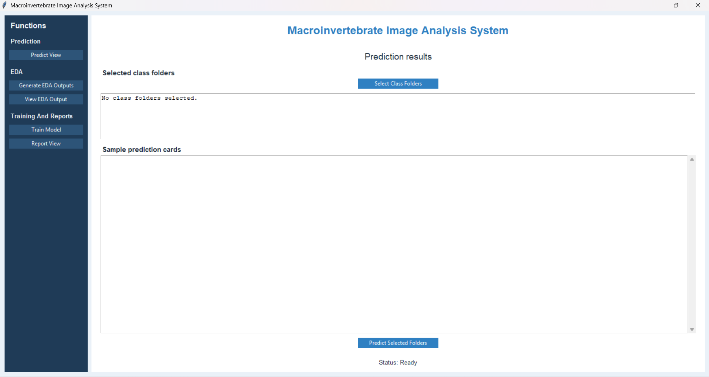
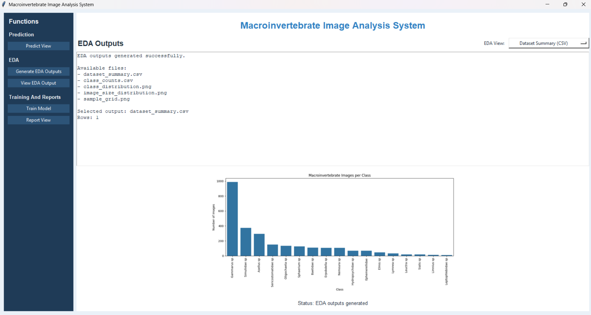
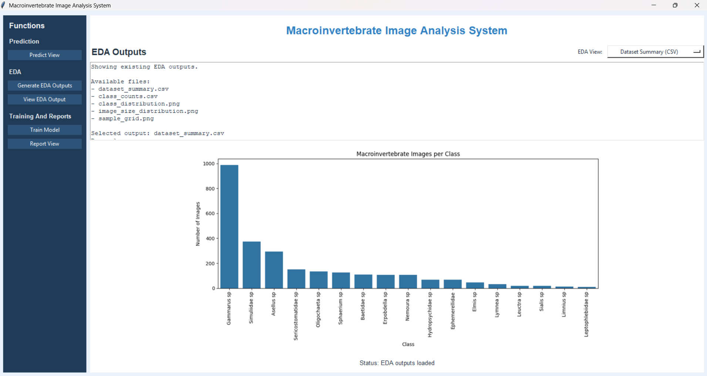
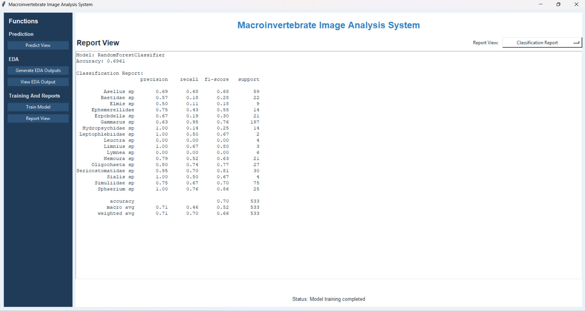
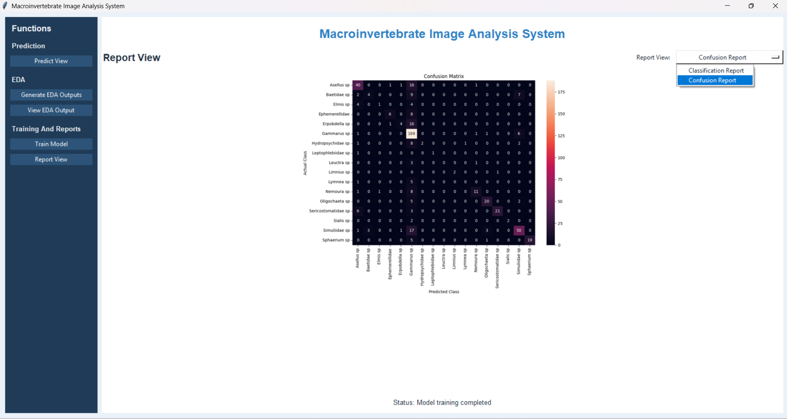
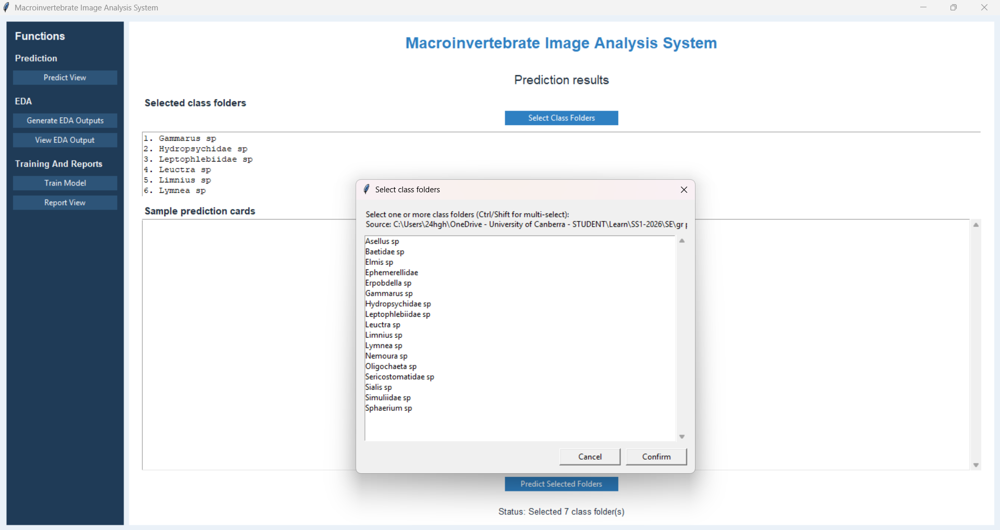
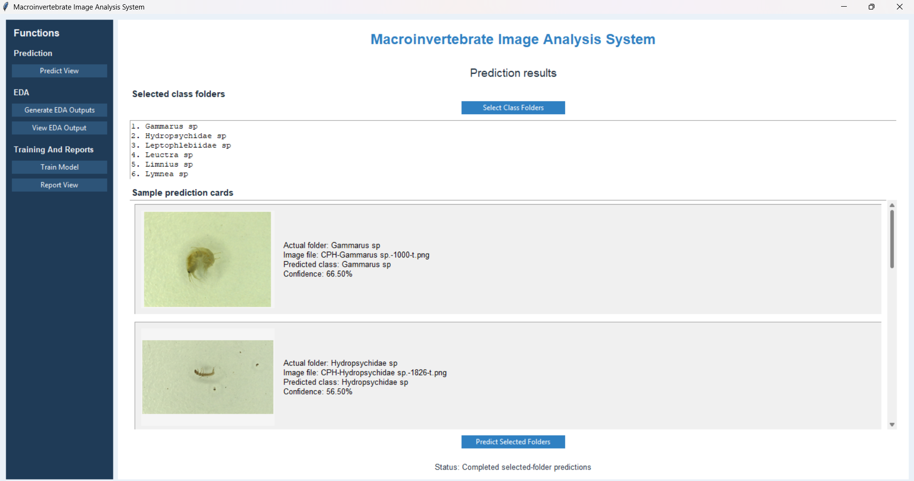
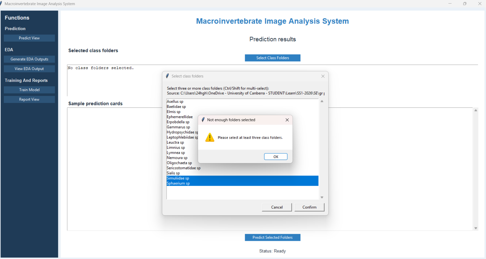

Student Name:
+  u3281913
+   u3293786
Unit: Software Technology 1 (8995)
Assignment: Assignment 3 - Macroinvertebrate Image Analysis System

## Manual Test Cases

| Scenario | Input | Expected Result | Actual Result | Evidence |
|---|---|---|---|---|
| Launch GUI | `python -m src.app` | Tkinter window opens | GUI window opened |  |
| Generate EDA outputs in GUI | Click `Generate EDA Outputs` | EDA charts and CSV files are generated | EDA outputs generated successfully |  |
| View EDA output in GUI | Click `View EDA Output` | Existing EDA outputs are displayed inside the app | EDA output displayed in-app |  |
| Train model in GUI | Click `Train Model` | Model trains, accuracy is shown, and reports are saved | Training completed message displayed |  |
| View classification report | Click `Report View`, then choose `Classification Report` in the report selector | Classification report is shown inside the app | Classification report displayed in-app |  |
| View confusion matrix | Click `Report View`, then choose `Confusion Report` in the report selector | Confusion matrix is shown inside the app | Confusion matrix displayed in-app |  |
| Select class folders | Click `Select Class Folders`, choose a parent folder, then select at least 3 class folders | Selected class folders are listed in the prediction panel | Selected folders displayed |  |
| Predict selected folders | Click `Predict Selected Folders` after selecting at least 3 folders | Sample cards show actual folder, image, predicted class, and confidence | Prediction cards displayed |  |
| Select fewer than 3 class folders | In the folder picker, select fewer than 3 items and click `Confirm` | Warning message asks user to select at least 3 class folders | Warning message displayed |  |

